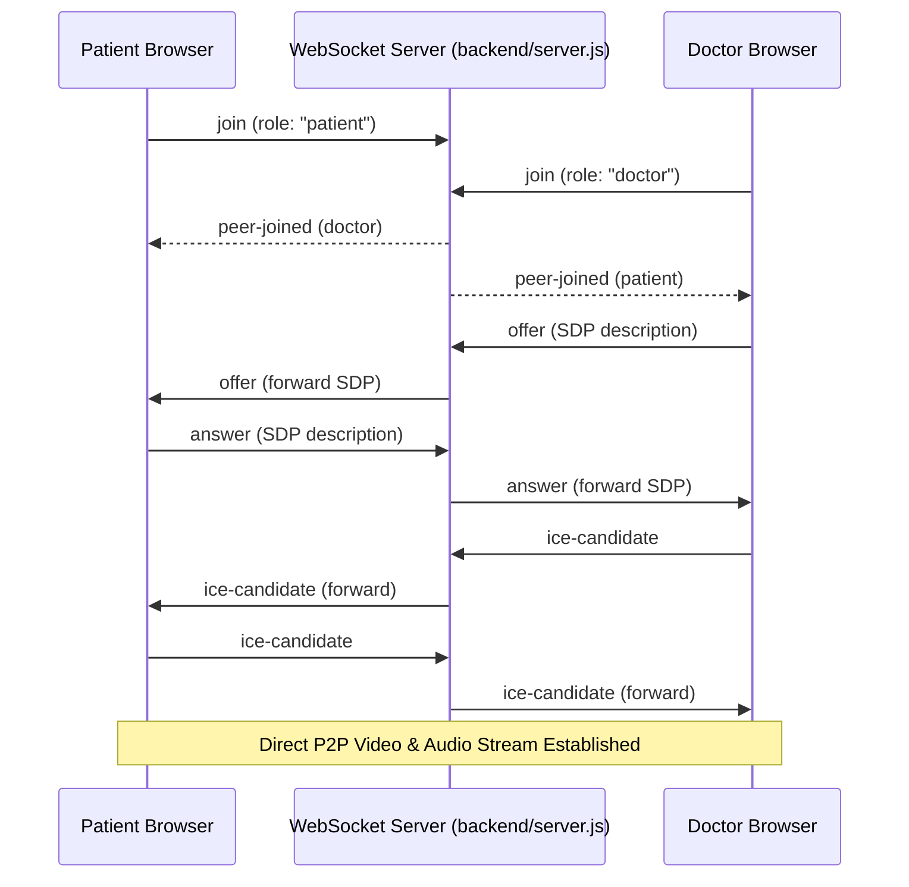

# <p align="center">🏥 MedXpert</p>
<p align="center">
  <strong>Advanced Telemedicine & Electronic Health Records (EHR) Platform</strong>
</p>

<p align="center">
  
  
  
  
  
  
</p>

---

## 📖 Table of Contents
- [🌟 Key Highlights](#-key-highlights)
- [🚀 Key Portal Features](#-key-portal-features)
- [⚡ Tech Stack](#-tech-stack)
- [📂 Project Structure](#-project-structure)
- [⚙️ Installation & Setup](#%EF%B8%8F-installation--setup)
- [🔄 WebRTC Architecture](#-webrtc-signaling--teleconsultation-architecture)
- [👥 Contributors](#-core-contributors)

---

## 🌟 Key Highlights

**MedXpert** is a premium, full-stack digital health application engineered to simplify medical operations and telemedicine. By bridging the gap between Patients, Doctors, and Administrators, MedXpert hosts a unified ecosystem of electronic health record management, real-time WebRTC audio/video consultations, automated prescription dispatch, and enterprise security auditing.

> [!TIP]
> ### 💡 Hybrid Dual-Mode Database Engine
> MedXpert features an intelligent database connectivity layer. By default, it connects to a **MongoDB** cluster. If local MongoDB is unavailable, it automatically boots an **ultra-fast, zero-dependency In-Memory JS Database Mock** mimicking MongoDB/Mongoose APIs. **Guarantees immediate execution out-of-the-box!**

---

## 🚀 Key Portal Features

<details>
<summary><b>🧑‍💼 1. Patient Portal (Click to expand)</b></summary>

- 📊 **Medical Dashboard:** Dynamic counters for future appointments, active prescriptions, and critical vitals tracker.
- 🔍 **Doctor Directory:** Smart directory with specialty filtering, experience sorting, and real-time telehealth consult triggers.
- 📂 **EHR Management:** Safe upload, indexing, and review of PDF laboratory reports and clinical findings.
- 📹 **Virtual Consults:** One-click integration to join secure video consultations with WebRTC audio/video connections.
- 🔑 **Prescriptions Locker:** View, store, and print/download physical prescription records (including dosage/schedules).
</details>

<details>
<summary><b>👨‍⚕️ 2. Doctor Dashboard (Click to expand)</b></summary>

- 📋 **Clinical Command Center:** View daily schedules, live appointment status, patient ratings, and warnings for documents requiring review.
- 🗂️ **Patient Registry:** Searchable patient logs detailing clinical histories, ages, and vital stats.
- 📞 **Telehealth Consultation Room:** Host real-time WebRTC meetings directly from the browser with active timers and video overlay overlays.
- 📝 **Smart Prescription Engine:** An automated flow where concluding a video call triggers a multi-row prescription dispatch form to issue medicines instantly.
</details>

<details>
<summary><b>🛡️ 3. Admin Control Panel (Click to expand)</b></summary>

- 👥 **User Management:** Central directory to add, search, and suspend/activate Patient or Doctor login credentials.
- 🛡️ **Doctor Onboarding & Verification:** Credentials validation queue to review and authorize doctor files before placing them live.
- 📝 **Real-time Activity Audit Logs:** Real-time log monitoring security and user actions with IP tags and status flags.
- ⚙️ **System Settings Configurator:** Direct controls for consultation slot timers, session timeouts, Two-Factor Auth (2FA), and E2E database encryption toggles.
</details>

---

## ⚡ Tech Stack

| Layer | Technology | Details |
| :--- | :--- | :--- |
| **Frontend** | React 19, Vite, Tailwind CSS v3 | Ultra-fast rendering, HSL colors, responsive layouts |
| **Backend** | Node.js, Express.js | Modular router architectures, WebRTC signaling |
| **Signaling** | WebSocket Server (`ws`) | Real-time signaling logic for peer-to-peer WebRTC |
| **Database** | MongoDB & Mongoose | Production-ready storage + local development fallback mock |
| **PDF Engine** | PDFKit | Automated generation of downloadable prescriptions |
| **Security** | JWT, Bcrypt.js, CryptoHelpers | Role-based authentication, cryptographic hashing |

---

## 📂 Project Structure

```bash
MedXpert/
├── backend/                  # Express API Server
│   ├── config/               # Database config (db.js hybrid connection layer)
│   ├── controllers/          # Business logic handlers
│   ├── middleware/           # Token validation & Role guards
│   ├── models/               # Mongoose schemas
│   ├── routes/               # REST API modular routers
│   ├── seed/                 # Seeding scripts & data helpers
│   └── server.js             # Main server & WebSocket Signaling
├── frontend/                 # Vite & React Frontend Application
│   ├── public/               # Static images & avatars
│   ├── src/                  # React Frontend Source & Dashboard JS
│   │   ├── components/       # Reusable UI Blocks (Navbar, Hero, Services)
│   │   ├── pages/            # High-level layouts
│   │   ├── index.css         # Styling system, CSS variables & theme tokens
│   │   └── main.jsx          # React mounting coordinator
│   ├── index.html            # Vite main application shell (Landing Page)
│   ├── medxpert.html         # Multi-Portal Dashboard UI
│   ├── tailwind.config.js    # Styling system tokens
│   └── vite.config.js        # Bundler & proxy config
├── package.json              # Root monorepo script runner
└── Dockerfile                # Docker build configuration
```

---

## ⚙️ Installation & Setup

### Step 1: Clone Repository
```bash
git clone https://github.com/Ashad-saifi/MedXpert.git
cd MedXpert
```

### Step 2: Backend Configuration & Start
Inside the `backend/` folder, install dependencies and start server:
```bash
cd backend
npm install
npm run dev
```

### Step 3: Frontend Configuration & Start
In a separate terminal, install dependencies and start frontend server:
```bash
cd frontend
npm install
npm run dev
```

Or run both from root:
```bash
npm run dev:backend   # Starts backend server (Port 5000)
npm run dev:frontend  # Starts frontend server (Port 3000)
```

### Step 3: Run Backend
```bash
npm install
npm run dev
```
Server runs on `http://localhost:5000`.

### Step 4: Run Frontend
In a new terminal window at the project root:
```bash
npm install
npm run dev
```
Vite dev server starts on `http://localhost:5173`.

---

## 🔄 WebRTC Signaling & Teleconsultation Architecture



---

## 👥 Core Contributors

<table align="center">
  <tr>
    
<td align="center"><strong>Ashad Saifi</strong><br>Full-Stack & WebRTC WebSockets</td>

  </tr>
</table>

---

## 📄 License
This application is developed under the MIT License and is meant for educational and internship training purposes.
