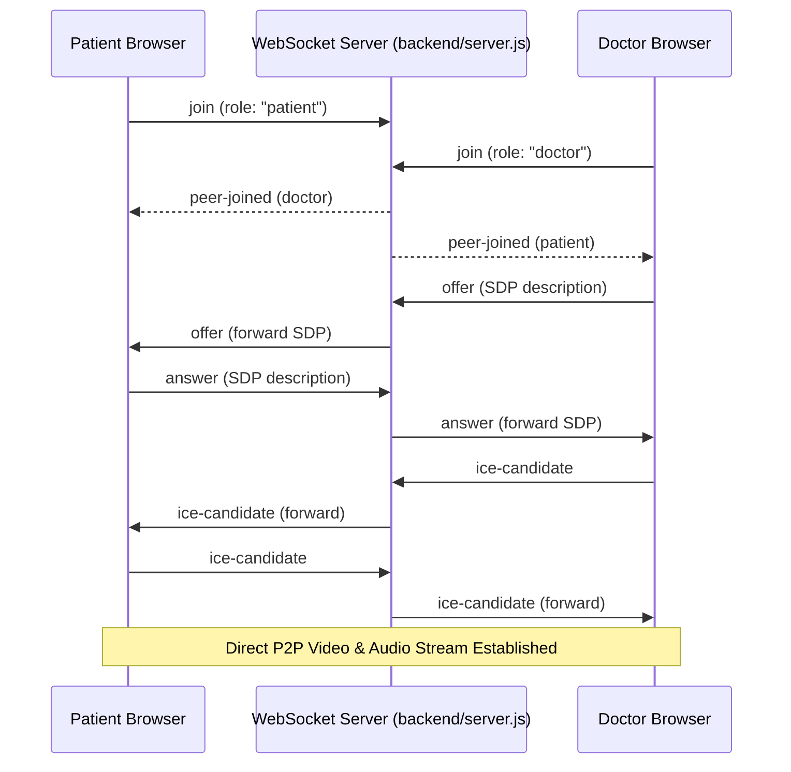

# 🏥 MedXpert — Advanced Telemedicine & Electronic Health Records (EHR) Platform

[](https://react.dev/)
[](https://vitejs.dev/)
[](https://tailwindcss.com/)
[](https://expressjs.com/)
[](https://mongoosejs.com/)
[](https://webrtc.org/)

MedXpert is a premium, full-stack digital health application engineered to simplify medical operations and telemedicine. By bridging the gap between Patients, Doctors, and Administrators, MedXpert hosts a unified ecosystem of electronic health record management, real-time WebRTC audio/video consultations, automated prescription dispatch, and enterprise security auditing.

### 🌟 Key Innovation: Hybrid Dual-Mode Database Engine
MedXpert features an intelligent database connectivity layer. By default, it connects to a **MongoDB** cluster (managed via Mongoose). If local MongoDB access is unavailable, the server automatically boots an **ultra-fast, zero-dependency In-Memory JS Database Mock** that mimics MongoDB/Mongoose methods (`find`, `findOne`, `create`, `findByIdAndUpdate`, etc.) and automatically seeds mock records. **This guarantees the application runs flawlessly out-of-the-box.**

---

## 🚀 Key Portal Features

### 🧑‍💼 1. Patient Portal
*   **Medical Dashboard:** Dynamic counters for future appointments, active prescriptions, and critical vitals tracker.
*   **Doctor Directory:** Smart directory with specialty filtering, experience sorting, and real-time telehealth consult triggers.
*   **EHR Management:** Safe upload, indexing, and review of PDF laboratory reports and clinical findings.
*   **Virtual Consults:** One-click integration to join secure video consultations with WebRTC audio/video connections.
*   **Prescriptions Locker:** View, store, and print/download physical prescription records (including dosage/schedules).

### 👨‍⚕️ 2. Doctor Dashboard
*   **Clinical Command Center:** View daily schedules, live appointment status, patient ratings, and warnings for documents requiring review.
*   **Patient Registry:** Searchable patient logs detailing clinical histories, ages, and vital stats.
*   **Telehealth Consultation Room:** Host real-time WebRTC meetings directly from the browser with active timers and video overlay overlays.
*   **Smart Prescription Engine:** An automated flow where concluding a video call triggers a multi-row prescription dispatch form to issue medicines instantly.

### 🛡️ 3. Admin Control Panel
*   **User Management:** Central directory to add, search, and suspend/activate Patient or Doctor login credentials.
*   **Doctor Onboarding & Verification:** Credentials validation queue to review and authorize doctor files before placing them live.
*   **Real-time Activity Audit Logs:** Real-time log monitoring security and user actions (e.g. system logins, settings updates, user suspension, database events) with IP tags and status flags.
*   **System Settings Configurator:** Direct controls for consultation slot timers, session timeouts, Two-Factor Auth (2FA), and E2E database encryption toggles.

---

## ⚡ Tech Stack

| Component | Technology | Description |
| :--- | :--- | :--- |
| **Frontend** | React 19, Vite, Tailwind CSS v3, JavaScript (ES6+) | Ultra-fast rendering, HSL colors, CSS Variables themes, responsive Grid layouts. |
| **Backend** | Node.js, Express.js | Modular router architectures, custom WebRTC signaling protocol. |
| **Signaling** | WebSocket Server (`ws`) | Real-time signaling logic to establish peer-to-peer WebRTC connections. |
| **Database** | MongoDB & Mongoose | Production-ready storage + custom fallback In-Memory JS Mock DB for local dev. |
| **PDF Engine** | PDFKit | Automated generation of downloadable prescriptions and summaries. |
| **Security** | JWT, Bcrypt.js, CryptoHelpers | Role-based authentication, cryptographic password hashing, and encrypted payload utilities. |

---

## 📂 Project Structure

```text
MedXpert/
├── backend/                  # Express API Server
│   ├── config/               # Database config (db.js hybrid connection layer)
│   ├── controllers/          # Business logic handlers (Users, Appointments, Reports, etc.)
│   ├── middleware/           # Token validation & Role authorization guards
│   ├── models/               # Mongoose schemas (User, Patient, Doctor, Prescription, etc.)
│   ├── routes/               # REST API modular routers
│   ├── seed/                 # Seeding scripts & data helpers
│   ├── server.js             # Main server & WebSocket WebRTC Signaling initialization
│   └── .env.example          # Template for backend environments
├── src/                      # React Frontend Source
│   ├── assets/               # Static images & resources
│   ├── components/           # Reusable UI Blocks (Navbar, Hero, Services, Modals)
│   ├── pages/                # High-level layouts (LandingPage)
│   ├── index.css             # Main styling system, CSS variables & theme tokens
│   ├── main.jsx              # React mounting coordinator
│   └── main.js               # Legacy DOM bindings & legacy portal functions
├── index.html                # Vite main application shell
├── medxpert.html             # Multi-Portal Dashboard (mounted backend dashboard UI)
├── tailwind.config.js        # Styling system tokens
├── vite.config.js            # Bundler proxy config (redirects /api to backend)
└── README.md                 # Project documentation
```

---

## ⚙️ Getting Started & Installation

Follow these steps to run MedXpert locally on your machine:

### 1. Clone & Set Up Directory
```bash
git clone https://github.com/Ashad-saifi/MedXpert.git
cd MedXpert
```

### 2. Configure Environment Variables
Inside the `backend/` folder, create a `.env` file using the example template:
```bash
cd backend
cp .env.example .env
```
Fill out the variables:
```env
PORT=5000
MONGO_URI=mongodb://localhost:27017/medxpert
JWT_SECRET=your_jwt_secret_token_key_here
```
*(If MongoDB is not running, the application will automatically fallback to the In-Memory mock DB, so don't worry!)*

### 3. Install Dependencies & Run Backend
From the `backend/` directory:
```bash
npm install
npm run dev
```
The server will boot on `http://localhost:5000`. You will see log prints confirming connection status.

### 4. Install Dependencies & Run Frontend
Navigate to the root workspace directory in a new terminal window:
```bash
npm install
npm run dev
```
Vite will launch the hot-reloading development server on `http://localhost:5173`.

---

## 🔄 WebRTC Signaling & Teleconsultation Architecture

The telehealth system implements peer-to-peer WebRTC connections managed via a custom WebSocket signaling protocol:



---

## 👥 Core Contributors

*   **Priyanka Vanga** - React components & UX workflows.
*   **Ashad Saifi** - Full-Stack architecture, Database refactoring, WebRTC WebSockets integration.
*   **Siddhant Mohan Jha** - Security frameworks & dashboard telemetry.

---

## 📄 License
This application is developed under the MIT License and is meant for educational and internship training purposes.
