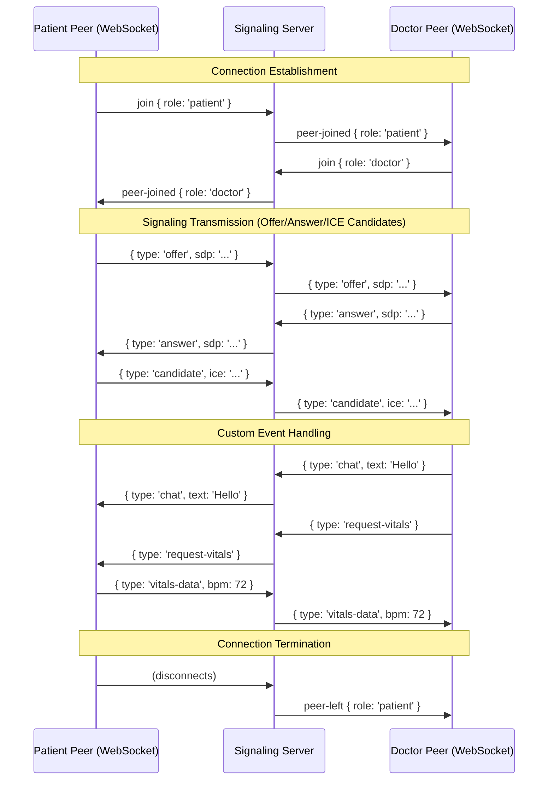

# MedXpert API Documentation

Welcome to the MedXpert API documentation. This document provides a detailed reference for all HTTP REST API endpoints, security mechanisms, database models, and real-time WebRTC WebSocket signaling server interactions.

---

## Table of Contents
1. [Overview & Configurations](#1-overview--configurations)
2. [Authentication & Security](#2-authentication--security)
3. [REST API Endpoints](#3-rest-api-endpoints)
    - [User & Authentication Routes (`/api/users`)](#user--authentication-routes-apiusers)
    - [Doctor Profile Routes (`/api/doctors`)](#doctor-profile-routes-apidoctors)
    - [Patient Profile Routes (`/api/patients`)](#patient-profile-routes-apipatients)
    - [Appointment Routes (`/api/appointments`)](#appointment-routes-apiappointments)
    - [Prescription Routes (`/api/prescriptions`)](#prescription-routes-apiprescriptions)
    - [Lab Report Routes (`/api/reports`)](#lab-report-routes-apireports)
    - [Admin Operations (`/api/admin`)](#admin-operations-apiadmin)
4. [Real-time WebRTC WebSocket Signaling](#4-real-time-webrtc-websocket-signaling)

---

## 1. Overview & Configurations

- **Base URL**: `http://localhost:5000` (or configured via `PORT` environment variable)
- **Content-Type**: `application/json` (unless specified otherwise, e.g., PDF binary files)
- **CORS Configuration**: Open access (`*`) enabled via Express CORS middleware.
- **Database**: MongoDB (Mongoose Object Document Mapping).

---

## 2. Authentication & Security

### JSON Web Token (JWT)
Protected endpoints require a Bearer token in the request header. If authorization fails or no token is supplied, the server responds with a `401 Unauthorized` status.

**Header Format:**
```http
Authorization: Bearer <your-jwt-token-string>
```

### Digital Signature Security (RSA-SHA256)
Prescriptions issued by doctors are signed cryptographically using an RSA-SHA256 asymmetric key pair managed by a self-healing keys initialization system.
- **Data String Format**: `${medicineName}|${dosage}|${patientId}|${date}|${prescriptionId}`
- **Signature**: Generated via an RSA private key and verified via the corresponding public key using Base64 encoding.

---

## 3. REST API Endpoints

### User & Authentication Routes (`/api/users`)

Modular Prefix: `/api/users` (with one compatibility mount at `/api/auth/login`)

#### `POST /api/users/register`
Registers a new user and creates an associated role-based profile (Patient or Doctor).

- **Access**: Public
- **Request Body**:
  ```json
  {
    "name": "Jane Doe",
    "email": "jane@example.com",
    "password": "securepassword123",
    "role": "patient", // "patient" | "doctor" (defaults to "patient")
    "phone": "9998887776",
    "specialty": "Pediatrics", // Required for doctor creation
    "exp": "8 years", // Doctor parameter (optional)
    "fee": "₹600", // Doctor parameter (optional)
    "hospital": "City General Hospital", // Doctor parameter (optional)
    "age": 28, // Patient parameter (optional)
    "gender": "Female", // Patient parameter (optional)
    "bloodType": "A+" // Patient parameter (optional)
  }
  ```
- **Success Response (201 Created)**:
  ```json
  {
    "user": {
      "id": "60d0fe4f5311236168a109ca",
      "name": "Jane Doe",
      "email": "jane@example.com",
      "role": "patient",
      "phone": "9998887776"
    },
    "profile": {
      "id": "P-10001",
      "user": "60d0fe4f5311236168a109ca",
      "name": "Jane Doe",
      "email": "jane@example.com",
      "age": 28,
      "gender": "Female",
      "bloodType": "A+",
      "height": "Not Specified",
      "weight": "Not Specified",
      "chronicConditions": "None",
      "allergies": "None",
      "emergencyContact": {
        "name": "Not Specified",
        "relation": "Not Specified",
        "phone": "Not Specified"
      },
      "insurance": {
        "provider": "Not Specified",
        "policyNo": "Not Specified",
        "validUntil": "Not Specified"
      }
    },
    "token": "eyJhbGciOiJIUzI1NiIsInR5cCI6IkpXVCJ9..."
  }
  ```
- **Error Responses**:
  - `400 Bad Request`: `{ "message": "Please enter name, email, and password" }`
  - `400 Bad Request`: `{ "message": "User already exists with this email" }`

#### `POST /api/users/login` (Also mounted at `/api/auth/login`)
Authenticates a user and returns a token along with their profile.

- **Access**: Public
- **Request Body**:
  ```json
  {
    "email": "jane@example.com",
    "password": "securepassword123"
  }
  ```
- **Success Response (200 OK)**:
  ```json
  {
    "user": {
      "id": "60d0fe4f5311236168a109ca",
      "name": "Jane Doe",
      "email": "jane@example.com",
      "role": "patient",
      "phone": "9998887776"
    },
    "profile": { ... },
    "token": "eyJhbGciOiJIUzI1NiIsInR5cCI6IkpXVCJ9..."
  }
  ```
- **Error Responses**:
  - `400 Bad Request`: `{ "message": "Please enter email and password" }`
  - `401 Unauthorized`: `{ "message": "Invalid email or password" }`

#### `GET /api/users/profile`
Retrieves the logged-in user's profile and account metadata.

- **Access**: Protected (JWT token required)
- **Success Response (200 OK)**:
  ```json
  {
    "user": {
      "_id": "60d0fe4f5311236168a109ca",
      "name": "Jane Doe",
      "email": "jane@example.com",
      "role": "patient",
      "phone": "9998887776"
    },
    "profile": { ... }
  }
  ```

#### `PUT /api/users/profile`
Updates personal account settings and syncs modifications to the associated clinical profile.

- **Access**: Protected (JWT token required)
- **Request Body** (All optional):
  ```json
  {
    "name": "Jane Smith",
    "email": "janesmith@example.com",
    "phone": "9876543210",
    "password": "newsecurepassword456"
  }
  ```
- **Success Response (200 OK)**:
  ```json
  {
    "user": {
      "id": "60d0fe4f5311236168a109ca",
      "name": "Jane Smith",
      "email": "janesmith@example.com",
      "role": "patient",
      "phone": "9876543210"
    },
    "profile": { ... },
    "token": "eyJhbGciOiJIUzI1NiIsInR5cCI6IkpXVCJ9..."
  }
  ```

#### `GET /api/users/test`
A simple diagnostic test endpoint.

- **Access**: Public
- **Success Response (200 OK)**:
  ```json
  { "message": "Auth routes placeholder" }
  ```

---

### Doctor Profile Routes (`/api/doctors`)

Modular Prefix: `/api/doctors`

> [!WARNING]
> While the endpoints below perform critical actions, standard route authorization middlewares are configured internally. Consult the developer guide for exact user-role restrictions.

| Method | Endpoint | Access | Description |
| :--- | :--- | :--- | :--- |
| **GET** | `/api/doctors` | Public | Retrieves a list of all doctor profiles. |
| **GET** | `/api/doctors/:id` | Public | Retrieves a single doctor's details by string ID (e.g., `D-101`) or ObjectId. |
| **POST** | `/api/doctors` | Private/Admin | Adds a new doctor and creates a user login credentials block. |
| **PUT** | `/api/doctors/:id` | Private/Admin | Updates doctor fields (specialty, experience, fee, hospital, status). |
| **DELETE** | `/api/doctors/:id` | Private/Admin | Deletes doctor profile and associated User object. |
| **POST** | `/api/doctors/approve/:id` | Private/Admin | Sets doctor profile status to `"Active"`. |
| **POST** | `/api/doctors/reject/:id` | Private/Admin | Rejects credentials and deletes doctor profile. |

#### Request & Response Details for Doctor Endpoints

- **`POST /api/doctors`** (Add Doctor)
  - **Body Payload**:
    ```json
    {
      "name": "Dr. Aarav Patel",
      "email": "aarav.patel@medxpert.com",
      "password": "defaultpassword123",
      "specialty": "Cardiology",
      "exp": "12 years",
      "fee": "₹1000",
      "license": "MCI-12345",
      "hospital": "Metro Heart Institute",
      "phone": "9876543212"
    }
    ```
  - **Success Response (201 Created)**:
    ```json
    {
      "success": true,
      "message": "Doctor added successfully",
      "doctor": {
        "id": "D-102",
        "name": "Dr. Aarav Patel",
        "email": "aarav.patel@medxpert.com",
        "specialty": "Cardiology",
        "exp": "12 years",
        "fee": "₹1000",
        "license": "MCI-12345",
        "hospital": "Metro Heart Institute",
        "rating": 4.8,
        "status": "Available Today"
      }
    }
    ```

- **`POST /api/doctors/approve/:id`** (Approve Doctor Credentials)
  - **URL Parameter**: `:id` - The custom ID string of the doctor (e.g., `D-101`).
  - **Success Response (200 OK)**: Returns a complete list of doctors updated after approval.
    ```json
    {
      "success": true,
      "message": "Doctor approved",
      "doctors": [ ... ]
    }
    ```

---

### Patient Profile Routes (`/api/patients`)

Modular Prefix: `/api/patients`

| Method | Endpoint | Access | Description |
| :--- | :--- | :--- | :--- |
| **GET** | `/api/patients` | Private | Retrieves a list of all patient profiles. |
| **GET** | `/api/patients/:id` | Private | Retrieves patient profile details by custom string ID (e.g., `P-10001`). |
| **POST** | `/api/patients` | Private/Admin | Creates a patient account, hashing the credentials. |
| **PUT** | `/api/patients/:id/profile` | Private | Dynamically updates patient clinical metrics and demography. |
| **PUT** | `/api/patients/:id/clinical-notes`| Private/Doctor | Updates chief complaints and clinical notes for patient. |
| **DELETE**| `/api/patients/:id` | Private/Admin | Removes patient profile and associated user. |

#### Request & Response Details for Patient Endpoints

- **`PUT /api/patients/:id/profile`** (Update Profile Details)
  - **Allowed Update Fields**: `name`, `email`, `age`, `gender`, `bloodType`, `height`, `weight`, `chronicConditions`, `allergies`, `emergencyContact` (object), `insurance` (object), `phone`, `dob`, `city`.
  - **Request Body Example**:
    ```json
    {
      "weight": "72 kg",
      "chronicConditions": "Hypertension",
      "allergies": "Penicillin",
      "emergencyContact": {
        "name": "Sarah Smith",
        "relation": "Sister",
        "phone": "9876543200"
      }
    }
    ```
  - **Success Response (200 OK)**:
    ```json
    {
      "success": true,
      "message": "Profile updated successfully",
      "patient": { ... }
    }
    ```

- **`PUT /api/patients/:id/clinical-notes`** (Update Clinical Notes)
  - **Access**: Restricted to Doctors / Clinical Staff.
  - **Request Body**:
    ```json
    {
      "clinicalNotes": "Patient shows mild improvements. Prescribed standard ACE inhibitors.",
      "chiefComplaint": "Occasional high blood pressure readings in mornings"
    }
    ```
  - **Success Response (200 OK)**:
    ```json
    {
      "success": true,
      "message": "Clinical notes updated successfully",
      "patient": { ... }
    }
    ```

---

### Appointment Routes (`/api/appointments`)

Modular Prefix: `/api/appointments`

#### `GET /api/appointments`
Retrieves a list of all booked appointments in the database.
- **Access**: Private

#### `GET /api/appointments/available-slots`
Retrieves available time slots for a specific doctor on a specific date.
- **Query Parameters**:
  - `doctorId` (string, e.g., `D-101`) - **Required**
  - `date` (string format `YYYY-MM-DD`) - **Required**
- **Success Response (200 OK)**:
  ```json
  {
    "success": true,
    "slots": [
      "09:00 AM",
      "10:00 AM",
      "11:30 AM",
      "02:30 PM",
      "04:00 PM"
    ]
  }
  ```

#### `POST /api/appointments/book`
Books a new consultation.
- **Request Body**:
  ```json
  {
    "doctorId": "D-101",
    "patientId": "P-10421",
    "dateTime": "2026-06-10T10:00:00.000Z",
    "type": "Video Consultation", // "Video Consultation" | "In-Person"
    "reason": "Routine hypertension follow-up",
    "status": "Pending" // Optional (defaults to "Pending")
  }
  ```
- **Success Response (200 OK)**:
  ```json
  {
    "success": true,
    "message": "Appointment booked successfully",
    "appointments": [ ... ]
  }
  ```

#### `POST /api/appointments/cancel/:id`
Cancels an active appointment by custom ID.
- **URL Parameter**: `:id` - The custom appointment ID string (e.g., `A-501`).
- **Success Response (200 OK)**:
  ```json
  {
    "success": true,
    "message": "Appointment cancelled successfully",
    "appointments": [ ... ]
  }
  ```

#### `POST /api/appointments/reschedule/:id`
Reschedules an appointment.
- **Request Body**:
  ```json
  {
    "dateTime": "2026-06-12T14:30:00.000Z",
    "rescheduledBy": "patient" // "patient" | "doctor" | "admin"
  }
  ```
- **Behavior**: If rescheduled by `patient`, the appointment status returns to `"Pending"` (requiring doctor approval). Otherwise, status is updated directly to `"Confirmed"`.
- **Success Response (200 OK)**:
  ```json
  {
    "success": true,
    "message": "Appointment rescheduled successfully",
    "appointments": [ ... ]
  }
  ```

#### `POST /api/appointments/verify-room`
Verifies authorization credentials before joining a WebRTC signaling room session.
- **Request Body**:
  ```json
  {
    "appointmentId": "A-501",
    "userId": "P-10421",
    "role": "patient" // "patient" | "doctor"
  }
  ```
- **Success Response (200 OK)**:
  ```json
  {
    "success": true,
    "token": "token_webrtc_A-501_P-10421_1717616142123",
    "message": "Appointment room session verified and access granted."
  }
  ```
- **Error Responses**:
  - `400 Bad Request`: Appointment is not `"Confirmed"` (e.g. Cancelled or Pending).
  - `403 Forbidden`: `userId` does not match the patient ID (or doctor ID) registered for that appointment.
  - `404 Not Found`: No appointment exists for the given ID.

#### `PUT /api/appointments/:id/status`
Updates status directly.
- **Request Body**: `{ "status": "Confirmed" }` // "Pending" | "Confirmed" | "Cancelled" | "Completed"
- **Success Response (200 OK)**:
  ```json
  {
    "success": true,
    "message": "Appointment status updated to Confirmed",
    "appointments": [ ... ]
  }
  ```

---

### Prescription Routes (`/api/prescriptions`)

Modular Prefix: `/api/prescriptions`

#### `GET /api/prescriptions`
Fetches all issued prescriptions.
- **Access**: Private

#### `POST /api/prescriptions/issue`
Issues digital prescriptions, generating unique cryptographic RSA-SHA256 signatures for each medication entry.
- **Access**: Restricted to Doctors
- **Request Body**:
  ```json
  {
    "patientId": "P-10421",
    "diagnosis": "Seasonal Allergies",
    "duration": "7 days", // "7 days" | "3 months" etc.
    "medicines": [
      {
        "name": "Cetirizine 10mg",
        "dosage": "1 tablet at bedtime"
      },
      {
        "name": "Fluticasone Nasal Spray",
        "dosage": "2 sprays in each nostril daily"
      }
    ]
  }
  ```
- **Behavior**: If `duration` equals `"3 months"`, the total allowed refills is set to `3`. Otherwise, it defaults to `1`.
- **Success Response (200 OK)**:
  ```json
  {
    "success": true,
    "message": "Prescription issued and sent to patient",
    "prescriptions": [ ... ]
  }
  ```

#### `GET /api/prescriptions/:id/download`
Downloads a formal, PDF-compiled medical record.
- **URL Parameter**: `:id` - The custom prescription ID (e.g., `RX-201`).
- **Access**: Public
- **Headers Returned**:
  - `Content-Type: application/pdf`
  - `Content-Disposition: attachment; filename=prescription_RX-201.pdf`
- **PDF Contents**:
  - Hospital clinical branding headers.
  - Patient & Physician demography details.
  - Medication name, dosage, duration, and refills remaining.
  - Cryptographic validation block showing the RSA-SHA256 signature hash.
  - QR Code containing a verification URL pointing to the verification portal.

#### `GET /api/prescriptions/verify/:id`
Authenticates the digital signature of a downloaded prescription using the server's public key.
- **URL Parameter**: `:id` - The custom prescription ID (e.g., `RX-201`).
- **Access**: Public (accessed by scanning the PDF's QR code or navigating directly).
- **Behavior**: Retrieves the prescription data, recalculates the payload format, verifies it against the signature key, and serves an interactive web page.
- **Response**: HTML document (Responsive, HSL Glassmorphic themed interface displaying authentic verification status or invalid signature warning).

---

### Lab Report Routes (`/api/reports`)

Modular Prefix: `/api/reports`

#### `GET /api/reports`
Retrieves all lab test reports.
- **Access**: Private

#### `POST /api/reports/upload`
Uploads a new lab test entry.
- **Request Body**:
  ```json
  {
    "testName": "Complete Blood Count (CBC)",
    "patientId": "P-10421",
    "lab": "Healthpath Laboratories"
  }
  ```
- **Success Response (200 OK)**:
  ```json
  {
    "success": true,
    "message": "Report uploaded successfully",
    "labReports": [ ... ]
  }
  ```

---

### Admin Operations (`/api/admin`)

Modular Prefix: `/api/admin`

#### `GET /api/admin/logs`
Aggregates and returns the 50 most recent system audit logs, system-wide settings, and analytics metrics.
- **Access**: Restricted to Admins
- **Success Response (200 OK)**:
  ```json
  {
    "logs": [
      {
        "_id": "60d0fe...",
        "time": "21:02:20",
        "user": "Admin",
        "action": "Modified system platform configurations",
        "ip": "127.0.0.1",
        "status": "Success",
        "createdAt": "2026-06-05T15:32:20.000Z"
      }
    ],
    "settings": {
      "platformName": "MedXpert",
      "supportEmail": "support@medxpert.com",
      "defaultDuration": "30 minutes",
      "maxPatientsPerDay": 20,
      "twoFAEnabled": true,
      "sessionTimeoutEnabled": true,
      "auditLoggingEnabled": true,
      "e2eEncryptionEnabled": true
    },
    "stats": {
      "totalPatients": 3842,
      "activeDoctors": 124,
      "consultationsToday": 287,
      "uptime": "99.8%"
    }
  }
  ```

#### `PUT /api/admin/settings`
Saves updated system configurations.
- **Access**: Restricted to Admins
- **Request Body**:
  ```json
  {
    "platformName": "MedXpert Premium Portal",
    "supportEmail": "admin-support@medxpert.com",
    "defaultDuration": "45 minutes",
    "maxPatientsPerDay": 30,
    "twoFAEnabled": false,
    "sessionTimeoutEnabled": true,
    "auditLoggingEnabled": true,
    "e2eEncryptionEnabled": true
  }
  ```
- **Success Response (200 OK)**:
  ```json
  {
    "success": true,
    "message": "Settings saved successfully",
    "settings": { ... }
  }
  ```

#### `POST /api/admin/users/suspend/:id`
Suspends (deletes) a user profile and deletes their login credentials.
- **URL Parameter**: `:id` - The custom ID string of the patient or doctor (starts with `P-` or `D-`).
- **Success Response (200 OK)**:
  ```json
  {
    "success": true,
    "message": "User account removed from the server successfully"
  }
  ```

#### `POST /api/admin/users/add`
Registers a user and creates their associated clinical profile, applying regex validations to input fields.
- **Access**: Restricted to Admins
- **Request Body**:
  ```json
  {
    "firstName": "Jane",
    "lastName": "Doe",
    "email": "jane.doe@example.com",
    "role": "Patient", // "Patient" | "Doctor" | "Admin"
    "phone": "9876543210",
    
    // Patient Profile Fields:
    "age": "28",
    "bloodType": "A+",
    "chronicConditions": "Asthma",
    
    // Doctor Profile Fields (required if role is "Doctor"):
    "specialty": "Pediatrics",
    "exp": "8 years",
    "fee": "₹600",
    "hospital": "City Hospital"
  }
  ```
- **Default Action**: Automatically hashes and sets password to `"password123"`.
- **Success Response (200 OK)**:
  ```json
  {
    "success": true,
    "message": "User added and invitation sent"
  }
  ```

#### `PUT /api/admin/users/edit/:id`
Edits registration and clinical profile details.
- **URL Parameter**: `:id` - The custom ID string of the user (starts with `P-` or `D-`).
- **Request Body**:
  ```json
  {
    "name": "Jane Doe-Smith",
    "email": "jane.smith@example.com",
    "phone": "9876543222",
    "age": 29,
    "bloodType": "A-",
    "conditions": "Asthma (Stable)"
  }
  ```
- **Success Response (200 OK)**:
  ```json
  {
    "success": true,
    "message": "User account updated successfully"
  }
  ```

---

## 4. Real-time WebRTC WebSocket Signaling

The server hosts a WebSocket service at `/` to coordinate WebRTC signaling connections between patient and doctor peers during live video consultations.

### Connection Architecture
The signaling server tracks clients dynamically in a map: `ws -> { role: 'patient' | 'doctor' }`.



### Protocol Message Reference

#### 1. Peer Join (`type: "join"`)
Sent by a peer immediately upon WebSocket connection to register their role.
- **Payload**:
  ```json
  {
    "type": "join",
    "role": "patient" // "patient" | "doctor"
  }
  ```

#### 2. Peer Notification: Joined (`type: "peer-joined"`)
Broadcast by the server to the opposing peer indicating a role has connected.
- **Payload**:
  ```json
  {
    "type": "peer-joined",
    "role": "patient"
  }
  ```

#### 3. Peer Notification: Left (`type: "peer-left"`)
Broadcast by the server to the opposing peer indicating a role has disconnected.
- **Payload**:
  ```json
  {
    "type": "peer-left",
    "role": "doctor"
  }
  ```

#### 4. WebRTC SDP Signal Exchange (`type: "offer"` / `"answer"`)
Passed transparently between patient and doctor to negotiate high-performance peer-to-peer media streams.
- **Payload Examples**:
  ```json
  {
    "type": "offer",
    "sdp": { ... }
  }
  ```
  ```json
  {
    "type": "answer",
    "sdp": { ... }
  }
  ```

#### 5. ICE Candidate Exchange (`type: "candidate"`)
Passed transparently between peers to negotiate connection routing.
- **Payload Example**:
  ```json
  {
    "type": "candidate",
    "candidate": { ... }
  }
  ```

#### 6. Custom Medical Consultation Events (`type: "chat"`, `"advice"`, `"mute-state"`, `"request-vitals"`, `"vitals-data"`)
Transmitted in real-time to manage remote checkups.
- **Vitals Request Payload**: `{ "type": "request-vitals" }`
- **Vitals Response Payload**: `{ "type": "vitals-data", "heartRate": 82, "bloodPressure": "120/80" }`
- **Chat Payload**: `{ "type": "chat", "message": "Can you check your blood pressure?", "sender": "doctor" }`
- **Advice Payload**: `{ "type": "advice", "advice": "Take deep breaths." }`
- **Mute State Payload**: `{ "type": "mute-state", "muted": true, "streamType": "audio" }`
